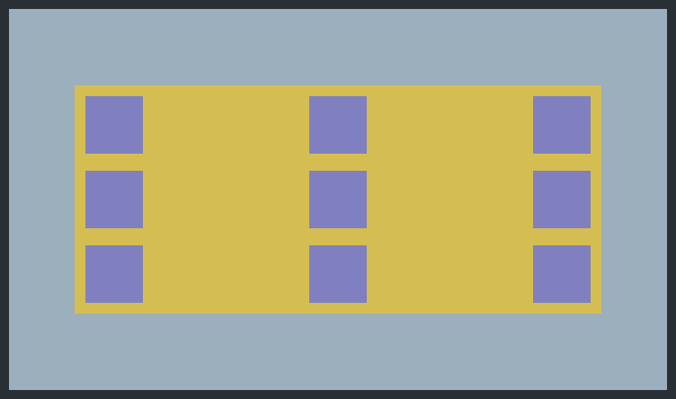
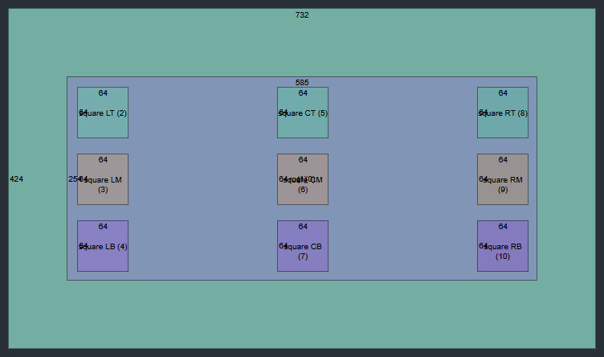

## What is it

This is a minimal library for creating web-based games. It uses default HTML DOM elements to create a visual interface. The structure of the interface is defined using code, and styling is done with standard CSS. This library doesn't rely on any UI frameworks (like React or Vue) but instead uses a simple object-oriented architecture. Of course, it requires a bundler (Webpack, Parcel, etc).

The library is still at an early stage of development and does not include many important UI-elements.

## How to use

Select any DOM element that will play the role of the UI root.

```typescript
let root_element = document.getElementById("root");
```

Create the UI

```typescript
let ui_root = new UIRoot(root_element);
```

After that, the ```ui_root``` object will monitor the change in the size of ```root_element``` and rebuild the UI based on these changes.

Next, we can add an UI-element to the UI. The main subject of each element is the rectangle

```typescript
let rect_0 = ui_root.add_rect(ui_root, "orange rect");
```

This will create an empty rectangle of zero size. The first parameter is a parent rectangle and the second is an internal label that will be displayed in the debug mode. Next, define anchors for the rectangle

```typescript
rect_0.set_anchors(0.1, 0.9, 0.2, 0.8);
```

Set some color to make the rectangle visible

```typescript
rect_0.set_color(232, 195, 45, 0.75);
```

Now, the UI looks as follows


To define the border of a rectangle, use the command

```typescript
rect_0.set_border(4, 41, 48, 53);  // define thickness and RGB color components
```

It's possible to add an offset to the boundaries of a rectangle. This will shift the sides from the top to the bottom (for top and bottom shifts) and from the left to the right (for left and right shifts)

```typescript
rect_0.set_offsets(32, 32, 32, 32);
```

If a rectangle is defined using anchors, it has a dynamic size that changes with respect to its parent size. However, it is also possible to create rectangles with fixed sizes

```typescript
let rect_lt = ui_root.add_rect(rect_0, "square LT");
rect_lt.set_color(128, 128, 192);
rect_lt.set_fixed_size(64, 64, 0.0, 0.0, CenterType.LEFT_TOP, 12, 12);

let rect_lm = ui_root.add_rect(rect_0, "square LM");
rect_lm.set_color(128, 128, 192);
rect_lm.set_fixed_size(64, 64, 0.0, 0.5, CenterType.LEFT_MIDDLE, 12, 0);

let rect_lb = ui_root.add_rect(rect_0, "square LB");
rect_lb.set_color(128, 128, 192);
rect_lb.set_fixed_size(64, 64, 0.0, 1.0, CenterType.LEFT_BOTTOM, 12, -12);

let rect_ct = ui_root.add_rect(rect_0, "square CT");
rect_ct.set_color(128, 128, 192);
rect_ct.set_fixed_size(64, 64, 0.5, 0.0, CenterType.CENTER_TOP, 0, 12);

let rect_cm = ui_root.add_rect(rect_0, "square CM");
rect_cm.set_color(128, 128, 192);
rect_cm.set_fixed_size(64, 64, 0.5, 0.5, CenterType.CENTER_MIDDLE, 0, 0);

let rect_cb = ui_root.add_rect(rect_0, "square CB");
rect_cm.set_color(128, 128, 192);
rect_cm.set_fixed_size(64, 64, 0.5, 1.0, CenterType.CENTER_BOTTOM, 0, -12);

let rect_rt = ui_root.add_rect(rect_0, "square RT");
rect_rt.set_color(128, 128, 192);
rect_rt.set_fixed_size(64, 64, 1.0, 0.0, CenterType.RIGHT_TOP, -12, 12);

let rect_rm = ui_root.add_rect(rect_0, "square RM");
rect_rm.set_color(128, 128, 192);
rect_rm.set_fixed_size(64, 64, 1.0, 0.5, CenterType.RIGHT_MIDDLE, -12, 0);

let rect_rb = ui_root.add_rect(rect_0, "square RB");
rect_rb.set_color(128, 128, 192);
rect_rb.set_fixed_size(64, 64, 1.0, 1.0, CenterType.RIGHT_BOTTOM, -12, -12);
```



To activate the debug mode, use the command

```typescript
ui_root.set_debug(true);
```

In debug mode, each rectangle is shown as a coloured rectangle with a black border. The size, label and id are also displayed



Add the image

```typescript
let img = ui_root.add_image(ui_root, "assets\\img_01.png", "image");
img.set_fixed_size(64, 64, 0.5, 0.5, CenterType.CENTER_MIDDLE, 0, 0);
```


Add the text

```typescript
let txt = ui_root.add_text(ui_root, "text");
txt.set_fixed_size(256, 128, 0.5, 0.5, CenterType.CENTER_MIDDLE, 0, 0);
txt.set_text("Text at center");
```

It's possible to define the used font

```typescript
txt.set_font("arial", 24, 900);
```

Text color

```typescript
txt.set_text_color(41, 48, 53);
```

Text align

```typescript
txt.set_align(TextAlignType.CENTER_MIDDLE);
```


Each UI-element has a unique ID. Its numerical value can be obtained by the command

```typescript
const id = txt.get_id();
```

As a string

```typescript
const id_str = txt.get_id_str();
```

As the string, the ID looks like ```GUID{number}```. These methods return the ID of the rectangular elements of each UI-elements. To obtain the image ID, use

```typescript
img.get_img_id();
img.get_img_id_str();
```

And for text UI-element

```typescript
txt.get_text_id();
txt.get_text_id_str();
```

The ID of each UI-element can be used to style it using CSS. You can also define a class for each element. For a base rectangle, use

```typescript
txt.add_class("class");
txt.delete_class("class");
```

To modify the class of an actual image UI-element

```typescript
img.add_image_class("class");
img.delete_image_class("class");
```

And for the actual text UI-element

```typescript
txt.add_text_class("class");
txt.delete_text_class("class");
```

To hide the entire UI-element and all its sub-elements, use

```typescript
txt.hide()
```

To make it visible

```typescript
txt.unhide()
```